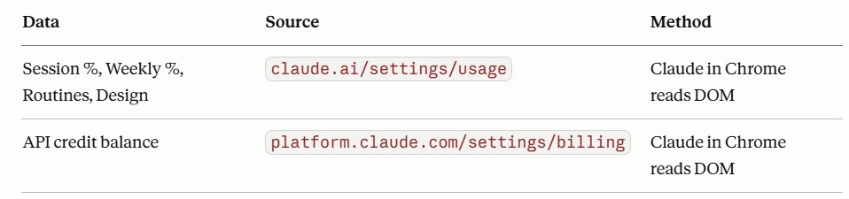

# Claude Metrics Dashboard


A practical beginner-friendly MCP experiment showing how Claude Desktop can read browser data and update local HTML dashboards automatically.

This lightweight dashboard tracks:

* Claude session usage
* Weekly plan limits
* API credits
* Additional usage metrics

All consolidated into a single local HTML dashboard.

---

> [!IMPORTANT]
> This project currently applies to paid Claude plans that expose usage and billing information through Claude Desktop and the Claude Chrome extension, such as Claude Pro, Max, Team, or Enterprise.
>
> Free-tier users may not see the same usage pages, metrics, or browser-access behavior demonstrated in this walkthrough.

---

# What This Project Demonstrates

This project combines two MCP-related capabilities:

* Filesystem access
* Browser interaction through the Claude Chrome extension

Together, they allow Claude Desktop to:

* read local files,
* update local HTML dashboards,
* open browser pages,
* navigate Claude usage pages,
* read live metrics,
* and write updated values directly into the dashboard.

For experienced MCP users, none of this will feel particularly new.

The goal here is different:
helping Claude users who have never touched MCP before understand, through a practical real-world example, how Claude Desktop can interact with systems outside the traditional chat interface.

---
# Why This Project Exists

MCPs (Model Context Protocols) are rapidly becoming one of the foundational pillars behind agentic AI workflows.

As AI systems evolve beyond isolated chat interactions and begin interacting with filesystems, browsers, applications, APIs, and external tools, protocols such as MCP increasingly become part of the connective tissue enabling those workflows to exist.

Although MCPs are not exclusive to Claude, the Claude ecosystem was the AI stack that most strongly illuminated these concepts during this particular exploration.

This project started as a lightweight practical experiment:
a simple visual dashboard consolidating Claude usage metrics into a persistent local HTML page.

But along the way, it also became a hands-on learning exercise around:

* MCP filesystem access
* browser automation
* local HTML updates
* Claude Desktop architecture
* and real-world agentic workflow foundations

Most of this was built through experimentation, documentation reading, trial-and-error, and occasionally racking my brain for hours trying to understand why something was not working.

Beyond the dashboard itself, projects like this help transform abstract AI concepts into something tangible, observable, and practical.

---

# Quick Setup (Experienced Users)

If you already:

* use Node.js,
* understand command-line basics,
* and are familiar with Claude Desktop,

you can probably complete the setup in under 10 minutes.

High-level flow:

1. Install Node.js
2. Install Claude Desktop
3. Install Claude Chrome Extension
4. Configure `claude_desktop_config.json`
5. Restart Claude Desktop
6. Ask Claude to refresh the dashboard

Detailed beginner-friendly instructions continue below.

---

# MCP Concepts Demonstrated

## Filesystem MCP Server

The filesystem MCP server allows Claude Desktop to:

* read local files,
* write local files,
* update dashboard data automatically.

Example configuration file location:

```text
C:\Users\[YOUR WINDOWS USERNAME]\AppData\Roaming\Claude\claude_desktop_config.json
```

Example configuration:

```json
{
  "mcpServers": {
    "filesystem": {
      "command": "npx",
      "args": [
        "-y",
        "@modelcontextprotocol/server-filesystem",
        "C:\\CODE"
      ]
    }
  }
}
```

---

## Browser Access Through Claude Chrome Extension

The Claude Chrome extension allows Claude Desktop to:

* open browser pages,
* navigate usage pages,
* read live browser data,
* and update the dashboard automatically.


---

# Browser Automation in Action

When Claude begins interacting with Chrome, you will see browser automation indicators such as:


Claude then navigates to:

* `claude.ai/settings/usage`
* `platform.claude.com/settings/billing`

and reads the required metrics directly from the browser DOM.


---

# Architecture Overview

The automation flow currently works as follows:



---

# Full Beginner Walkthrough

> [!TIP]
> If you already use Node.js regularly and know `node` and `npx` are properly installed and available from the command line, you can safely skip this section and **JUMP to step #3**.


## 1. Install Node.js

Download and install Node.js:

https://nodejs.org/

This also installs:

* `node`
* `npx`

Claude Desktop uses `npx` to launch MCP servers automatically in the background.

---

## 2. Verify Node.js Installation

Sometimes Node.js installs correctly, but Windows does not properly register the `node` and `npx` commands in the system PATH.

When that happens:

* Claude Desktop cannot start the MCP server,
* and dashboard updates may silently fail.

Open a command window and verify both commands work:

```bash
node -v
npx -v
```

Both should return version numbers successfully.

---

<details>
<summary><strong>New to Windows command lines?</strong></summary>

Windows command windows are text-based interfaces traditionally used to run system commands manually.

You can open one by:

* Pressing `WINDOWS + R`
* Typing `cmd`
* Pressing ENTER

Alternative options:

* `powershell`
* right-click Start button → "Terminal"

</details>

---
> [!NOTE]
> The command window does NOT need to remain open after installation or verification.
>
> Claude Desktop automatically launches the filesystem MCP server in the background during startup using the configuration stored in `claude_desktop_config.json`.

## 3. Install Claude Desktop

Download:

https://claude.ai/download

Important:
this project requires Claude Desktop, not only the browser version of Claude.

---

## 4. Install the Claude Chrome Extension

Install the official Claude extension published by Anthropic from the Chrome Web Store.

This extension allows Claude Desktop to interact with browser pages opened in Chrome.

Without it:

* live usage fetching will not work.

---

## 5. Create a Working Folder

Example:

```text
C:\CODE
```

Save the dashboard HTML file inside this folder.

---

## 6. Configure MCP Filesystem Access

Navigate to:

```text
C:\Users\[YOUR WINDOWS USERNAME]\AppData\Roaming\Claude\
```

Locate or create:

```text
claude_desktop_config.json
```

Paste:

```json
{
  "mcpServers": {
    "filesystem": {
      "command": "npx",
      "args": [
        "-y",
        "@modelcontextprotocol/server-filesystem",
        "C:\\CODE"
      ]
    }
  }
}
```

What this configuration does:

* launches the filesystem MCP server,
* allows Claude Desktop to access files inside `C:\CODE`,
* allows Claude to update the dashboard automatically.

Important:

* replace `C:\\CODE` with your own folder if needed,
* Windows paths inside JSON files require double backslashes.

---

## 7. Restart Claude Desktop

Completely close and reopen Claude Desktop.

The filesystem MCP server activates during startup.

---

## 8. Make Sure You Are Logged Into Claude in Chrome

Open Google Chrome and confirm you are already logged into:

* `claude.ai`

---

## 9. Ask Claude to Update the Dashboard

Inside Claude Desktop, type something natural such as:

```text
Fetch my dashboard data and update C:\CODE\claude-usage.html
```

or:

```text
Refresh my Claude usage dashboard
```

Claude will:

* open usage pages,
* read current metrics,
* update the dashboard HTML automatically.

---

## 10. Approve Browser Permissions

The first time you run this, Claude will likely request permission to access:

* `claude.ai`
* `platform.claude.com`

Allow both.

These are normally one-time approvals.

---

## 11. Refresh the Dashboard

Claude writes the updated values directly into your local HTML file.

To view updates:

* double-click the HTML file,
* or press F5 if it is already open in your browser.

---

# Final Dashboard


---

# Security Notes

This project does not use:

* unofficial browser scraping tools,
* third-party automation frameworks,
* external APIs,
* or credential storage.

Browser interaction happens through:

* Claude Desktop
* the official Claude Chrome extension
* MCP permissions you explicitly approve

Always review MCP configurations before granting filesystem access.

---

# Important Disclaimer

This is not an official Anthropic project, nor an authoritative implementation reference for MCP architecture or security practices.

The goal is educational and exploratory:
helping newer users better understand how Claude Desktop, MCP servers, browser access, and local file interaction can work together in practical workflows.

---

# Related Links

* CallGenix: https://www.callgenix.com
* Claude Desktop: https://claude.ai/download
* MCP Documentation: https://modelcontextprotocol.io
