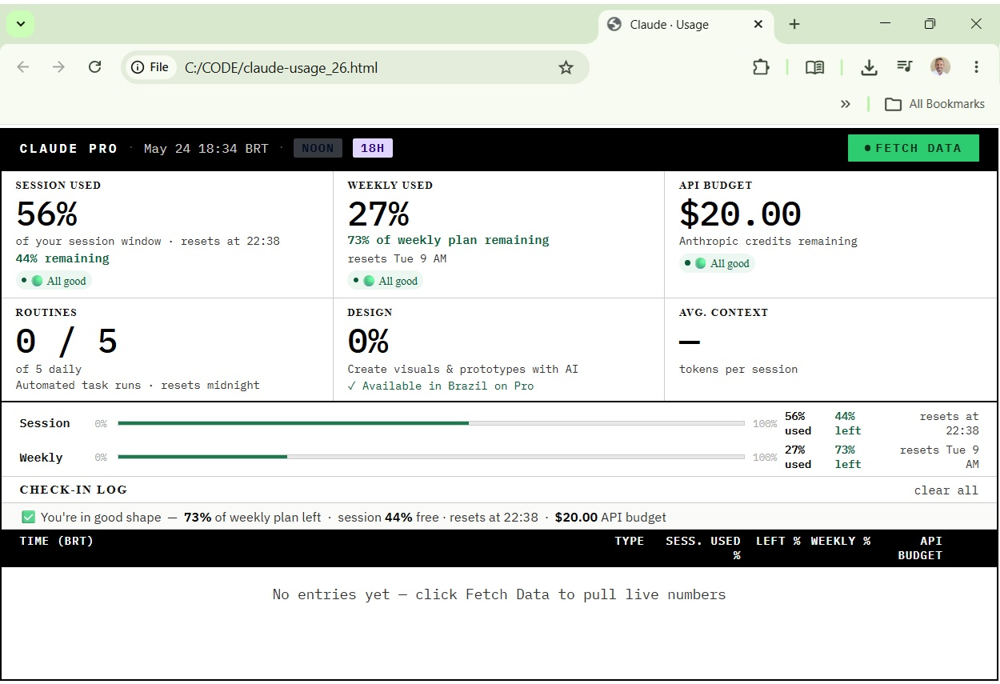
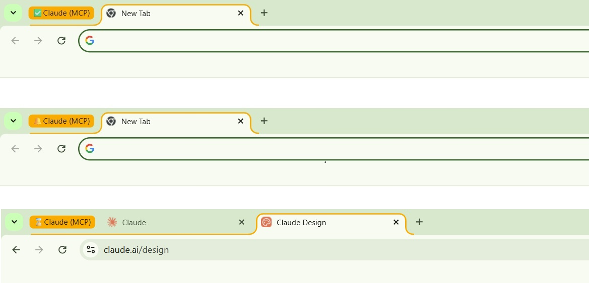
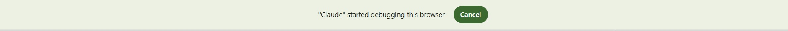
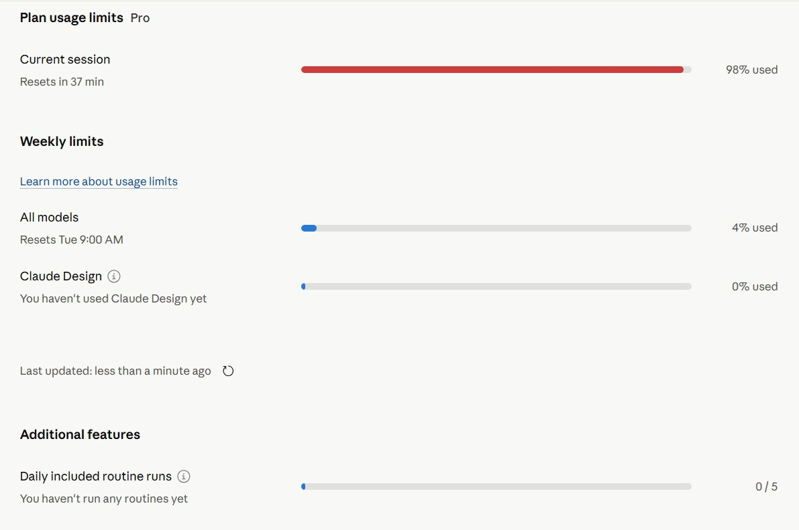
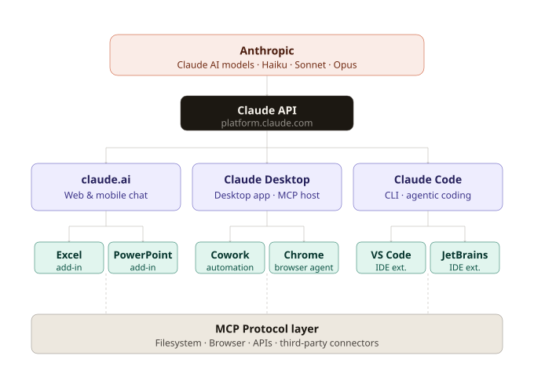

# Claude Metrics Dashboard

[](https://github.com/callgenix/claude-metrics-dashboard/releases/download/v1.0.0/claude-usage.html)

One HTML file. Live metrics from your Claude account — session window, weekly plan, and API credits.

---

## Download

👉 **[Download claude-usage.html](https://github.com/callgenix/claude-metrics-dashboard/releases/download/v1.0.0/claude-usage.html)**

Save it anywhere on your machine. Open it in Chrome. That is it.

---

## Quick start — experienced users

**What you need:** Node.js · Claude Desktop · Claude for Chrome extension · paid Claude plan.

**1.** Configure `claude_desktop_config.json`:
```json
{
  "mcpServers": {
    "filesystem": {
      "command": "npx",
      "args": ["-y", "@modelcontextprotocol/server-filesystem", "C:\\CODE"]
    }
  }
}
```

**2.** Restart Claude Desktop completely.

**3.** From an established Claude Desktop conversation (not a fresh tab, not a Project), say:
> *"Fetch my dashboard data"*

Approve the one-time browser permissions.

**4.** Open `claude-usage.html` in Chrome and press F5.

---

## What actually happens — step by step

This section is for anyone who wants to understand what Claude is doing when it runs the fetch. This is the part that surprised me the most when I first saw it.

---

### Step 1 — You point Claude at a local folder

Before anything else, you add a short config to Claude Desktop that tells it which folder on your machine it can read and write. This is the **Filesystem MCP** — one of the two capabilities that make this whole thing work.

```
C:\Users\[YOUR USERNAME]\AppData\Roaming\Claude\claude_desktop_config.json
```

Once configured and restarted, Claude Desktop has access to your `C:\CODE` folder (or wherever you saved the dashboard file).

---

### Step 2 — You type a phrase. Claude starts moving.

In any **established** Claude Desktop conversation, you say something like:

> *"Fetch my dashboard data"*

The phrasing is flexible. Claude understands the intent, not a specific keyword. Within seconds, you will see the Chrome extension badge change state.



The **Claude (MCP) badge** on your browser tab changes color as Claude works:
- ✅ Green checkmark — active and ready
- 🔔 Yellow bell — Claude is processing
- ⏳ Orange hourglass — mid-task, browser interaction in progress

---

### Step 3 — The browser tells you Claude is in control

Chrome shows a notification band at the top of the browser window:



**"Claude started debugging this browser"** — this is Chrome's own security feature confirming that Claude Desktop, via the MCP protocol and the Claude Chrome extension, has been granted access to inspect and interact with your browser tabs.

This is not a warning to be alarmed about. It is standard browser behavior when any MCP-connected tool activates. You approved this when you installed the extension. You will see this notification every time a fetch runs.

---

### Step 4 — Claude opens your usage page and reads the numbers

Claude navigates to `claude.ai/settings/usage` and `platform.claude.com/settings/billing`, reads the live values directly from the page DOM, and passes them back to Claude Desktop.



This is the same page you would visit manually to check your usage. Claude is doing it for you and extracting every number automatically — session percentage, weekly limit, Design usage, routine runs, and API credit balance.

---

### Step 5 — Press F5. Your dashboard is live.

Claude writes the updated values into your local HTML file via the filesystem MCP. Open `claude-usage.html` in Chrome and press F5. All metrics reflect exactly what Claude just read from your account page.

No third-party tools. No APIs. No credential storage.

---

## The Claude product ecosystem

Every node in this diagram is a real product. It shows how Anthropic's AI models connect, through the API, down to the tools you use every day — including the two that power this dashboard: Claude Desktop and Claude for Chrome.

[](https://github.com/callgenix/claude-metrics-dashboard/blob/main/ecosystem.svg)

---

## Optional reading

<details>
<summary><strong>What it tracks</strong></summary>
<br>

| Metric | Resets |
|---|---|
| Session window | Every ~5 hours (rolling) |
| Weekly plan | Every Tuesday at 9 AM |
| API credit balance | Never — only depletes with direct API calls |
| Routines and Design usage | Daily / weekly |

Claude measures session and weekly capacity in a proprietary unit. Anthropic does not publish the exact token equivalence. The percentages shown here come directly from your account page.

</details>

<details>
<summary><strong>Understanding the ecosystem diagram</strong></summary>
<br>

**1 · Anthropic at the top** — the company that trains the models. Haiku, Sonnet, and Opus are the engines. Everything else is a way of reaching one of them.

**2 · Claude API** — the single gateway everything goes through. Developers hit it directly. Every Claude product sits on top of it.

**3 · Three interfaces, same AI** — claude.ai (browser/mobile), Claude Desktop (MCP host), Claude Code (CLI for developers). Different experiences, same models underneath.

**4 · Extensions per interface** — Excel and PowerPoint add-ins from claude.ai. Cowork and Claude for Chrome from Desktop. VS Code and JetBrains from Claude Code.

**5 · MCP Protocol layer** — the connective tissue that allows Claude to reach outside the chat window into your files, browser, and external services. Without MCP, this dashboard would not exist.

</details>

<details>
<summary><strong>Requirements in detail</strong></summary>
<br>

| What | Why |
|---|---|
| Node.js (any recent version) | Claude Desktop uses `npx` to start the MCP server |
| Claude Desktop | The MCP host — the browser version alone will not work |
| Claude for Chrome | Official Anthropic extension for browser interaction |
| A paid Claude plan | Pro, Max, Team, or Enterprise |

Verify Node.js is properly installed:
```bash
node -v
npx -v
```
Both should return version numbers. If either fails, reinstall from [nodejs.org](https://nodejs.org).

</details>

<details>
<summary><strong>A note on scope</strong></summary>
<br>

This started as a simple personal experiment — a way to understand how Claude Desktop, MCP, and browser automation work together in practice. The dashboard was the excuse. The learning was the point.

It uses only official tools published by Anthropic. It does not scrape, reverse-engineer, or circumvent anything. It reads the same usage data you can see manually by visiting your settings page.

Want to customize it? Fork the repo and make it your own. That is what GitHub is for.

</details>

---

## Related

- [Callgenix.com](https://www.callgenix.com) — the AI demo catalog where this project lives
- [Claude Desktop](https://claude.ai/download)
- [MCP Documentation](https://modelcontextprotocol.io)

---

*Not affiliated with or endorsed by Anthropic.*
